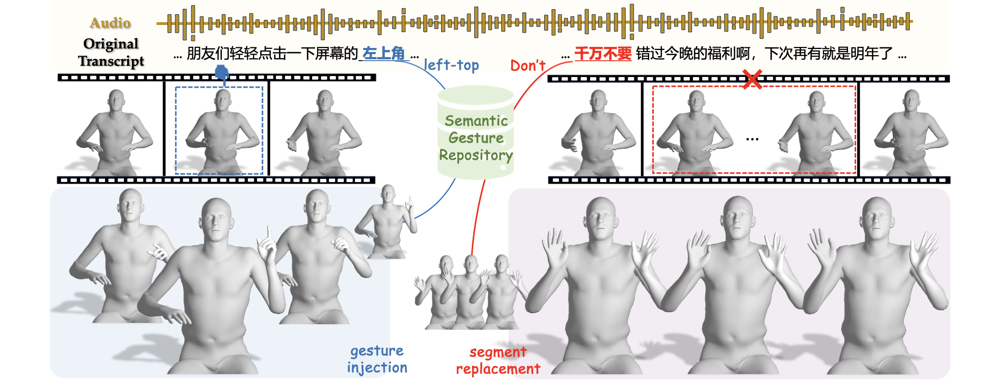

<div align="center">

# GestureHYDRA

### Semantic Co-speech Gesture Synthesis via Hybrid Modality Diffusion Transformer and Cascaded-Synchronized Retrieval-Augmented Generation

[Quanwei Yang<sup>1,*</sup>](#) ·
[Luying Huang<sup>2,*</sup>](#) ·
[Kaisiyuan Wang<sup>2,†</sup>](#) ·
[Jiazhi Guan<sup>2</sup>](#) ·
[Shengyi He<sup>2</sup>](#) ·
[Fengguo Li<sup>2</sup>](#) ·
[Hang Zhou<sup>2</sup>](#) ·
[Lingyun Yu<sup>1</sup>](#) ·
[Yingying Li<sup>2</sup>](#) ·
[Haocheng Feng<sup>2</sup>](#) ·
[Hongtao Xie<sup>1,†</sup>](#)

<sup>1</sup>University of Science and Technology of China
<br>
<sup>2</sup>Baidu Inc.
<br>
<sup>*</sup>Equal contribution.
<sup>†</sup>Corresponding authors.

[](https://arxiv.org/abs/2507.22731v2)
[](https://mumuwei.github.io/GestureHYDRA/)
[](https://www.python.org/)

</div>

## Teaser

<div align="center">
  <a href="assets/teaser1.pdf">
    
  </a>
</div>

GestureHYDRA is a semantic co-speech gesture generation framework that combines a hybrid modality diffusion transformer with a cascaded-synchronized retrieval-augmented generation pipeline, enabling more reliable semantic gesture activation and flexible gesture editing.

## Overview

Human co-speech gestures are not only rhythmic body movements, but also important carriers of explicit semantics. GestureHYDRA focuses on synthesizing gestures with stronger semantic awareness, especially instructional hand gestures such as numbers, directions, greeting, and denial. To support this setting, the project is built around three key components:

- A hybrid modality diffusion transformer for gesture modeling under audio, text, and identity conditions.
- A cascaded-synchronized retrieval-augmented generation pipeline for reliable semantic gesture activation and temporal synchronization.
- The Streamer dataset, a large-scale co-speech gesture dataset emphasizing semantically explicit hand gestures in real-world streaming scenarios.

According to the paper appendix, the Streamer dataset includes:

- 18 semantic gesture categories
- 281 anchor actors
- about 58 hours of video
- 10-second clips sampled at 25 FPS
- 22 kHz audio

## Main Features

- Semantic-aware co-speech gesture generation with hybrid conditioning.
- Retrieval-augmented semantic gesture activation for more controllable outputs.
- Support for gesture editing settings including generation, gesture injection, in-betweening, and motion segment replacement.
- A repository structure designed for training, inference, evaluation, demos, and future checkpoint release.

## Results Preview

<!-- The repository is organized to support the following qualitative result categories.

| Semantic activation | Gesture injection | In-betweening | Segment replacement |
| --- | --- | --- | --- |
| Add side-by-side examples showing explicit semantic gestures triggered by speech. | Add examples that inject target semantic gestures into generated motion. | Add examples that fill missing motion spans while preserving continuity. | Add examples that replace undesired segments with synchronized target gestures. |

Recommended media to add before public release:

- `demo/semantic_activation.gif`
- `demo/gesture_injection.gif`
- `demo/inbetweening.gif`
- `demo/segment_replacement.gif` -->

## Installation

```bash
conda env create -f environment.yml
conda activate gesturehydra
pip install -e .
```

Inspect the current command-line interfaces with:

```bash
python3 scripts/train.py --help
python3 scripts/infer.py --help
python3 scripts/prepare_streamer.py --help
```

## Getting Started

Example training command:

```bash
python3 scripts/train.py \
  --config configs/data/streamer.yaml \
  --config configs/model/gesturehydra_base.yaml \
  --config configs/train/base.yaml
```

Example inference command:

```bash
python3 scripts/infer.py \
  --config configs/data/streamer.yaml \
  --config configs/model/gesturehydra_base.yaml \
  --config configs/inference/base.yaml
```

## Repository Structure

```text
GestureHydra/
|-- assets/                      # figures, teaser media, and project assets
|-- checkpoints/                 # model checkpoints
|-- configs/
|   |-- data/                    # dataset configuration
|   |-- inference/               # inference configuration
|   |-- model/                   # model configuration
|   `-- train/                   # training configuration
|-- data/                        # local datasets, ignored by git
|-- demo/                        # qualitative examples and demo outputs
|-- outputs/                     # logs, predictions, and experiment artifacts
|-- gesturehydra/                # project source package
|-- scripts/                     # training, inference, and preprocessing entrypoints
`-- tools/                       # one-off utilities
```

## Dataset

The expected local dataset layout is:

```text
data/
`-- streamer-dataset
    ├── test_seen
    │   ├── anon_audios
    │   ├── audio_features
    │   └── gestures
    ├── test_unseen
    │   ├── anon_audios
    │   ├── audio_features
    │   └── gestures
    └── train
        ├── anon_audios
        ├── audio_features
        └── gestures
```

Additional placeholder details are provided in [data/README.md](data/README.md).

## Citation

If you find this work useful in your research, please cite:

```bibtex
@article{yang2025gesturehydra,
  title   = {GestureHYDRA: Semantic Co-speech Gesture Synthesis via Hybrid Modality Diffusion Transformer and Cascaded-Synchronized Retrieval-Augmented Generation},
  author  = {Quanwei Yang and Luying Huang and Kaisiyuan Wang and Jiazhi Guan and Shengyi He and Fengguo Li and Hang Zhou and Lingyun Yu and Yingying Li and Haocheng Feng and Hongtao Xie},
  journal = {arXiv preprint arXiv:2507.22731},
  year    = {2025}
}
```

## Acknowledgement

This repository is currently in the initial release stage. Before making the project fully public, please update the final repository URL in `CITATION.cff` and add the final software and data license. See [LICENSE_NOTICE.md](LICENSE_NOTICE.md) for the current release note.
